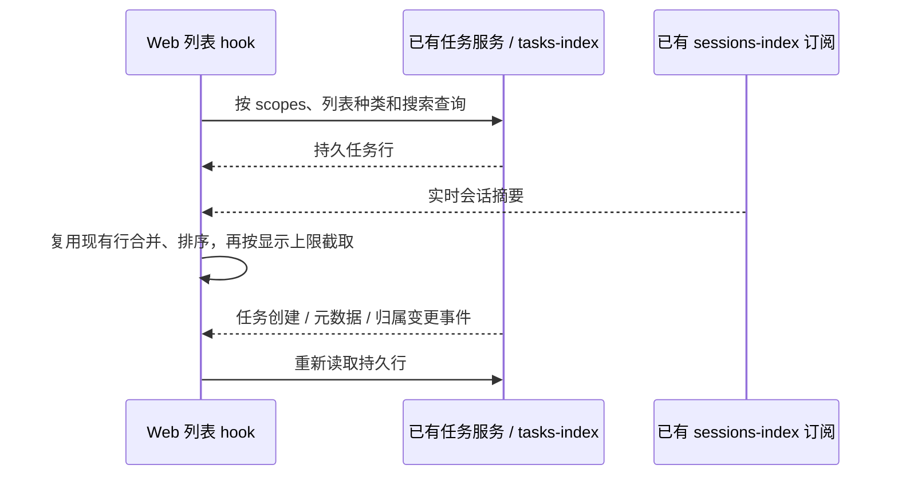

# 独立 Web 的任务列表

## 范围与规则

- 独立 Web（连接 `/ws`）的 HTTP Server 没有窗口 Controller。Web 入口通过现有可选的 `windowControllerService` 表达这一差异，共用列表 hook 改用已有 `zcodeTaskService.listTaskList`。
- 这是上游 3.14.3 已有的列表读取缺口，与本 fork 的品牌和资料目录隔离改动无关。
- 手机连接桌面（`?remote=...`）和桌面 Renderer 继续走窗口 Controller；不改变 Host attachment、Agent 启动、会话恢复、owner/lease 或两种流式交付语义。
- 任务、置顶、归档及分组使用的共用列表读取都遵循这一选择。项目行仍走原有读取路径，分组结构与写入命令不变。
- `active` 的口径与 Controller 一致：包含普通与置顶任务，排除归档任务。独立 Web 合并现有 timeline/pinned 分区查询；不修改服务端原有查询语义。
- 只读取当前打开的 workspace scopes。身份键仍为 `workspaceIdentity?.trim() || workspacePath`，不扫描其它目录，不迁移数据。

## 唯一所有者与接口

- tasks-index 是持久任务行、置顶、归档、删除与未读状态的所有者；已有任务服务负责查询与写入。
- sessions-index 是实时会话状态的所有者。Web 复用已有共享订阅，只补充已存在的任务行，不把 session-only 的摘要变成历史记录。
- 共用 `useGlobalTaskList` 增加读取路径选择，保留上游 Controller 的查询、订阅和缓存逻辑。独立 Web 的读取结果、加载状态及实时投影集中在 `useStandaloneTaskList`，无 Controller 时启用。
- 不增加数据库、任务状态服务或第二条写入路径。停用的 Web hook 不查询任务，也不订阅任务事件或实时会话。

实时摘要只重新计算展示列表；低频任务事件通过已有 membership 版本失效后重查，避免流式输出逐帧触发任务 RPC。查询返回前 scopes 或请求代次发生变化时，旧结果不能覆盖新列表。

## 失败语义

读取失败沿用上游处理：记录错误日志、保留最后成功的列表，并结束加载状态。首次读取失败时列表仍可能显示空态，用户可以刷新页面重新读取。本次只修复读取路径，不增加错误文案、重试组件或其它页面改动；不用超时探测 Controller 或自动重试循环。

## 验收

1. 使用现有用户数据打开独立 Web：任务区能显示 conversation workspace 的历史记录，项目行仍正常；刷新页面后记录仍在。
2. 打开历史任务可以加载聊天内容；新建、改名、置顶、取消置顶、归档、取消归档通过原有命令更新对应列表。
3. 分组视图能读到同一持久任务集合；搜索正文仍保留服务端搜索摘要。
4. sessions-index 更新只补充已有行，运行任务按现有规则排序；分页在补实时信息后截取。
5. 读取失败记录日志并保留已加载列表，成功空列表显示原有空态；旧请求不能覆盖新的 scopes 或排序。
6. 桌面及手机远控继续选择 Controller，不增加独立 Web 的任务事件和 sessions-index 订阅。

自动验证覆盖列表分区与搜索条件、任务身份、读取错误传递、实时排序和分页；浏览器交互验证覆盖历史显示、打开、刷新及归属操作。实施后执行 typecheck、lint、架构检查和 Web 构建。

## 回归入口

- 单元测试：`pnpm exec tsx --tsconfig packages/ui/tsconfig.json --test packages/ui/test/standaloneTaskList.test.ts`。
- 验证用浏览器夹具在完成事件刷新、旧请求隔离和 Controller 路径验收后移除，长期保留一个单元测试文件。
- 真实验收使用现有 Web 实例及用户资料，置顶、归档和改名测试后恢复原值。
